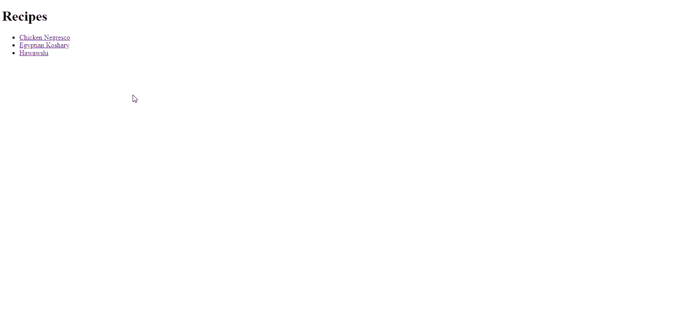

# Resapeez


## Project Overview
This project is a recipe website built to practice basic HTML elements and skills including boilerplate, paragraphs, headings, lists, links, images, and website file organization.

## Tech/Framework Used
- HTML

## Features
- Main index page linking to multiple recipe pages
- Each recipe page includes:
  - Title
  - Image
  - Description
  - Ingredients list
  - Step-by-step instructions

## Installation and Usage

1. **Clone the Repository:**
   ```bash
   git clone git@github.com:aaelsay3d/resapeez.git
   ```

2. **Navigate to the Project Directory:**
    ```bash
    cd resapeez
    ```

3. **Viewing the Website:**
    Open `index.html` in your web browser to view the main page with links to individual recipes.

4. **Navigating to a Recipe:**
    Click on any recipe link on the main page to view the detailed recipe page.

5. **Returning to the Home Page:**
    Use the `Back to Home` button at the end of each recipe page to return to the main index page.

## Credits and Acknowledgment
All images and recipes sourced from [allrecipes.com](https://www.allrecipes.com/).

## License
This project is licensed under the [MIT License](./LICENSE).
